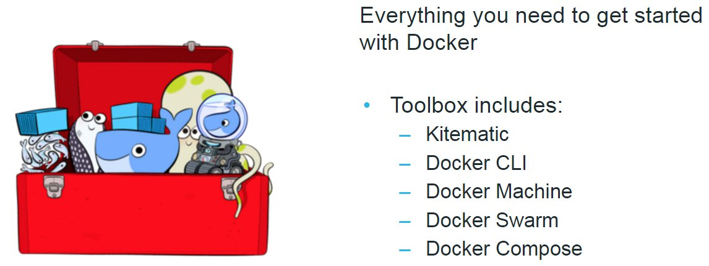

## Docker Commands

* Toolbox
* Workflow
* CLI Commands
* Dockerfile Commands

---



---

### Workflow

_See Flipchart_

---

### CLI Commandos

```
docker ps -a 
docker images -a
docker build -t <IMAGE_NAME> <DIR>
docker run ubuntu:14.04 /bin/echo "Hello World"
docker run --rm=true -d --env-file "<PATH_TO_ENV_FILE>" -v <LOCAL_FOLDER>:<CONTAINER_FOLDER> --name "<CONTAINER_NAME>" <IMAGE_NAME>:<IMAGE_TAG> <ARGUMENTS> 
docker login -e <E-MAIL> -p <PASSWORD> -u <USERNAME> <SERVER>
docker push [REGISTRYHOST/]<IMAGENAME>[:<IMAGETAG>]
docker pull [REGISTRYHOST/]<IMAGENAME>[:<IMAGETAG>]
docker start <CONTAINER> ...
docker stop <CONTAINER> ...
docker commit <CONTAINER>
docker rm <CONTAINER>
```

---

### Dockerfile Commands

```
FROM <IMAGE_NAME>:<IMAGE_TAG>
MAINTAINER <NAME> <SURNAME> "name.surname@company.com"
ENV <VARIABLE>=<VALUE>
RUN <Shell_COMMAND> (e.g. apt-get update)
ADD <FILE> <CONTAINER_FOLDER>
COPY <FILE/FOLDER> <CONTAINER_LOCATION>
VOLUME <FOLDER_TO_BE_MOUNTED>
EXPOSE <PORT>
ENTRYPOINT ["<PROGRAMM>"]
CMD ["<PARAM1>", "<PARAM2>"]
```

---

[__Finally, it's DEMO time!__](..)
